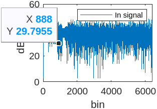
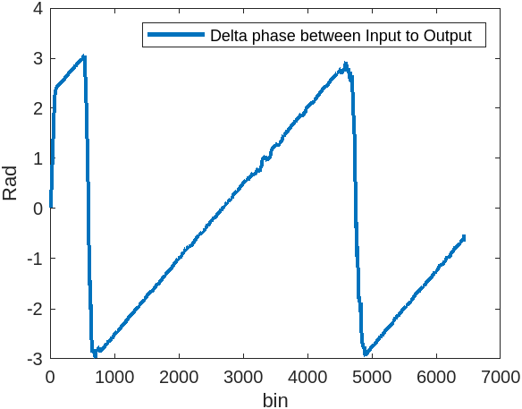
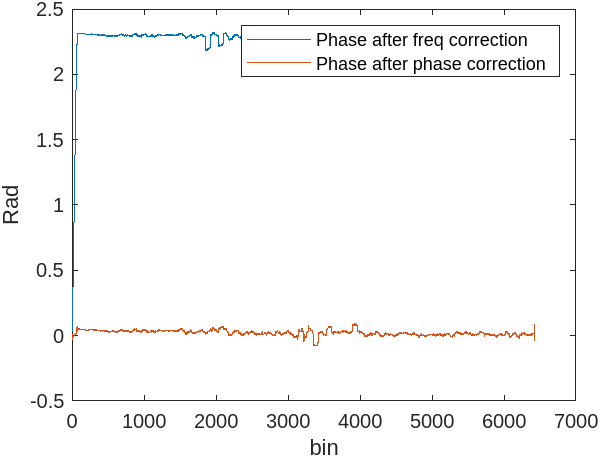
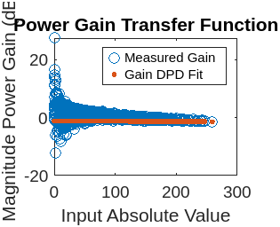

# Digital Predistortion (DPD) Algorithm

This project implements a Digital Predistortion (DPD) algorithm to linearize power amplifiers (PAs) in wireless communication systems. The DPD algorithm compensates for nonlinearities in the PA by predistorting the input signal.

# Table of Contents

1. [Project Overview](#project-overview)
2. [Requirements](#requirements)
3. [How to Use `Run_DPD_Algorithm`](#how-to-use-run_dpd_algorithm)
4. [Input and Output Description](#input-and-output-description)
5. [Example Usage](#example-usage)

# Project Overview

The DPD algorithm is designed to improve the linearity of power amplifiers by applying an inverse nonlinearity to the input signal. This project includes:

A MATLAB function Run_DPD_Algorithm to execute the DPD algorithm.

Helper scripts and data files for testing and validation.

# Requirements

To run this project, you need:

1. MATLAB (tested on R2021a or later).

2. Signal Processing Toolbox (for functions like pwelch and resample).

3. Input and output signal data files (e.g., fxp_40MHz_sample_rate_H7B20L1000.mat and test.mat) which are included in this repository.

4. See HowToMatlab.md for easily cloning this repository into your local matlab session/ 

# How to Use Run_DPD_Algorithm

The Run_DPD_Algorithm function is the main entry point for running the DPD algorithm. It takes three input arguments and returns three outputs.
`[NMSE, Cond_num,Y_fit] = Run_DPD_Algorithm(Polynomial_order, Polynomial_Memory, Bool_Orthogonal);`

## Input Arguments

1. **Polynomial_order**  
   The order of the polynomial used in the DPD model.  
   - **Example:** `3` (for a 3rd-order polynomial).  

2. **Polynomial_Memory**  
   The memory depth of the DPD model.  
   - **Example:** `5` (for a memory depth of 5).  

3. **Bool_Orthogonal**  
   A boolean flag to specify whether to use orthogonal polynomials:  
   - `1`: Use orthogonal polynomials.  
   - `0`: Use non-orthogonal polynomials.  

## Output Arguments

1. **NMSE**:
The Normalized Mean Squared Error (NMSE) between the input and output signals after applying DPD.
This metric quantifies the performance of the DPD algorithm.

2.**Cond_num**:
The condition number of the matrix used in the DPD coefficient calculation.
This indicates the numerical stability of the solution.

3. **Y_fit**
The outsignal produced by the amplifier after aplying DPD
## Input and Output Description

1. Input Data
The input signal (z) is loaded from fxp_40MHz_sample_rate_H7B20L1000.mat.

The signal (Y) is loaded from test.mat.

2. Output Data
The function returns the NMSE and condition number as metrics for evaluating the DPD performance.

## Example Usage

Below is an example of how to use the Run_DPD_Algorithm function:

Example 1: Run DPD with Default Parameters
% Run DPD with a 5th-order polynomial, memory depth of 1, and orthogonal polynomials
`[NMSE, Cond_num, DPD_sig] = Run_DPD_Algorithm(5, 1, 1);`
Example 1 output:


```
NMSE =

  -55.9239


Cond_num =

   11.5806

>> 
```
Example plot output: 
### Plot 1


### Plot 2


### Plot 3


### Plot 4

